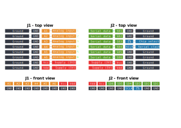
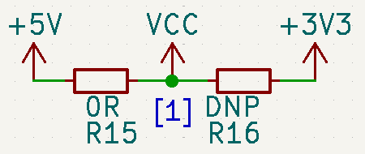
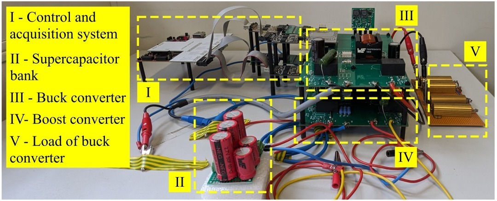

.. _sec-adc-board-six-channels:

adc-board-six-channels
======================

``adc-board-six-channels`` is a board containing six ADCs, intended for single-ended measurements. The boad supports ADCs with SOT-23-6 package and SPI interface.

A diagram of the board is shown in  :numref:`fig-adc-board-six-channels-diagram`, where:

* :math:`\text{V}_\text{CC}` and :math:`\text{V}_\text{DD}` are supply inputs. The ADCs can be supplied either with :math:`\text{V}_\text{CC}` (typically 3V3) or :math:`\text{V}_\text{DD}` (typically 5V). This depends on the specific ADC mounted on the board.
* :math:`\text{A}_1, \dots, \text{A}_6` are the analog inputs.
* :math:`\bar{\text{CS}}` and :math:`\text{CLK}` are the chip select and clock signals. These two signals are shared among all ADCs on the board.
* :math:`\text{SD}_1, \dots, \text{SD}_6` are the data outputs of the ADCs.

   
   Diagram of the board.

Board and pinout
----------------

A fully populated board is shown in :numref:`fig-adc-board-six-channels-adc-board`. The analog inputs are on the left (connector J1), while SPI interface is on the right (connector J2). The board's pinout is shown in :numref:`fig-adc-board-six-channels-pinout`.

.. figure:: img/adc-board-six-channels/adc-board.svg
   :name: fig-adc-board-six-channels-adc-board
   :scale: 10%
   :align: center
   :alt: Populated board.
   
   Populated board.

   
   Pinout of the board.
 

ADC compatibility
-----------------

The board supports any ADC having the footprint shown in :numref:`fig-adc-board-six-channels-adc-footprint`. Example of compatible ADCs

* TI's ADC121S021 (12 bit, 50-200 ksps)
* Analog Devices' MAX11665 (12 bit, 500 ksps)

.. figure:: img/adc-board-six-channels/adc-footprint.svg
   :name: fig-adc-board-six-channels-adc-footprint
   :scale: 100%
   :align: center
   :alt: Footprint of ADC.
   
   ADC's footprint.

Channel diagram
--------------------

All channels are identifical, consisting essentially of a low-pass filter and an ADC. The circuit diagram is shown in :numref:`fig-adc-board-six-channels-channel-diagram`. The cut-off frequency :math:`f_\text{c}` of the filter is given by

.. math::
   
   f_\text{c} = \frac{1}{2\pi R C}.

The cut-off frequency can be adjusted according to the desired filtering requirements or sampling rate. Each channel can have a different cut-off frequency; however, all channels will have the same sampling rate since they share the chip select and clock signals.

.. figure:: img/adc-board-six-channels/channel-diagram.svg
   :name: fig-adc-board-six-channels-channel-diagram
   :scale: 150%
   :align: center
   :alt: Single channel diagram.
   
   Circuit diagram of a single channel.

To help damping ringing in case of a longer cables on connector J2, a small resistor :math:`\text{R}_\text{d}` is placed in series with the data output line of the ADC. 

Supplying the board
-------------------

As shown in :numref:`fig-adc-board-six-channels-diagram`, the ADCs can be powered either with :math:`\text{V}_\text{CC}` (typically 3.3 V) or :math:`\text{V}_\text{DD}`  (typically 5 V). The voltage source is selected by populating the proper resistor on the PCB, as indicated in :numref:`fig-adc-board-six-channels-supply`. Depending on which resistor is populated and which is not, the ADCs are powered as follows:

* R15 populated, R16 not placed: ADCs are powered with 5 V (:math:`\text{V}_\text{DD}`)
* R16 not placed, R15 populated: ADCs are powered with 3.3 V (:math:`\text{V}_\text{CC}`)

   
   Selecting the voltage source for the ADCs.

.. note::
   :math:`\text{V}_\text{DD}` and :math:`\text{V}_\text{CC}` do not have to necessarily be 5 V and 3.3 V. You can choose if you want to power the ADCs with :math:`\text{V}_\text{DD}` or :math:`\text{V}_\text{CC}`, as long as the chosen rail is within the voltage levels of the ADC chip.

Isolation
---------

Isolated measurements are possible by combining the ``adc-board-six-channels`` board with the :ref:`sec-digital-isolator-2t6r` isolator board. An example is shown :numref:`fig-adc-board-six-channels-general-adc-iso-board`.

.. figure:: img/general/adc-iso-board.svg
   :name: fig-adc-board-six-channels-general-adc-iso-board
   :scale: 10%
   :align: center
   :alt: ADC + dig. iso board.
   
   Isolated measurements by combining the ``adc-board-six-channels`` and :ref:`sec-digital-isolator-2t6r` boards.
   

Signal preconditioning 
----------------------

If signal conditioning is required, it is possible to combine an ADC board with an amplifier board, see :ref:`sec-amplifier-board-six-channels`. With the amplifier board, it is possible to amplify and offset analog voltage or current signals. It is also possible to use the board as an analog buffer. See :ref:`sec-amplifier-board-six-channels` for more details.

Why six channels?
-----------------

Originally, the board was intended to be used in three-phase systems, to sample three voltage and three current signals. That's why the board was designed with six analog channels.

Application example
-------------------

This board has been used as part of research projects on dc/dc converters. They were used to capture voltage and current measurements, and were controlled by an FPGA. One example is shown in :numref:`fig-general-buck-boost-setup-adc-board`. In this case, two boards were used to convert signals from two different converters. In this setup, the ADC121S021 chip was used, with a sampling frequency of 200 kHz for one converter and 100 kHz for another converter, and a clock of 16.7 MHz.

   
   ADC board put to use.

Fabrication files
-----------------

To get the gerber files used to fabricate the ADC board, checkout commit ``34480072c29c523887cbbbe66a5d34a5624f99fb``, and find the files under ``adc-board-six-channels/gerber``.
