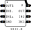

.. _sec-amplifier-board-six-channels:

amplifier-board-six-channels
============================

The ``amplifier-board-six-channels`` is a board containing six amplifiers, intended for gain and offset of analog signals. The board supports six analog channels. Its diagram is shown in :numref:`fig-amplifier-board-six-channels-diagram`, where:

* :math:`\text{V}_\text{CC}` and :math:`\text{V}_\text{DD}` are supply inputs. The amplifiers and reference generator can be supplied either with :math:`\text{V}_\text{CC}` (typically 3V3) or :math:`\text{V}_\text{DD}` (typically 5V). 
* :math:`\text{A}_{i1}, \dots, \text{A}_{i6}` are the analog inputs.
* :math:`\text{A}_{o1}, \dots, \text{A}_{o6}` are the analog outputs.

   
   Diagram of the board.

Board and pinout
----------------

A partially populated board is shown in :numref:`fig-amplifier-board-six-channels-board`. The analog inputs are on the left (connector J1), while the analog outputs are on the right (connector J2).

.. figure:: img/amplifier-board-six-channels/board.svg
   :name: fig-amplifier-board-six-channels-board
   :scale: 10%
   :align: center
   :alt: Partially populated board.
   
   Partially populated board.

The board's pinout is shown in :numref:`fig-amplifier-board-six-channels-pinout`.

.. figure:: img/amplifier-board-six-channels/pinout.svg
   :name: fig-amplifier-board-six-channels-pinout
   :scale: 150%
   :align: center
   :alt: Pinout of the board.
   
   Pinout of the board.

Amplifier compatibility
------------------------

The board supports any two-channel amplifier having the footprint shown in :numref:`fig-amplifier-board-six-channels-footprint`. Example of compatible isolators:

* 
* 
* 

   
   Amplifiers's footprint.

Single channel diagram
-----------------------

.. figure:: img/amplifier-board-six-channels/diagram-single.svg
   :name: fig-amplifier-board-six-channels-diagram-single
   :scale: 130%
   :align: center
   :alt: Diagram of single channel.
   
   Diagram of a single channel.

Reference (offset)
------------------

Why this number of channels?
----------------------------

Has this board ever been used?
------------------------------

Fabrication files
-----------------

To get the gerber files used to fabricate the isolator board, checkout commit ``a134106d05d90f406177a17ca4cb45505ea1c51b``, and find the files under ``digital-isolator-2t6r/gerber``