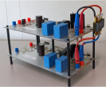
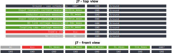
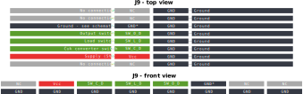
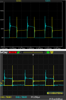
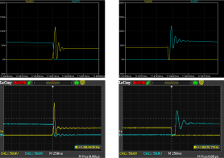
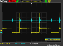
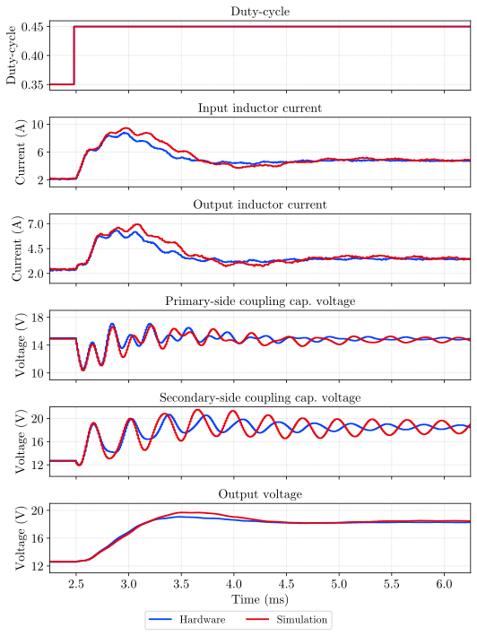

.. _sec-cuk-iso-ps:

cuk-iso-ps
======================

``cuk-iso-ps`` is a PCB used to assemble an isolated Ćuk converter, meant to be used as an experimental platform for research and teaching in control in power electronics. Assembling  one converter requires two ``cuk-iso-ps`` PCBs and a high-frequency transformer.  

Introduction
------------

A diagram of an isolated Ćuk converter is shown in :numref:`fig-cuk-iso-ps-diagram`.

   
   Diagram of the isolated Ćuk converter.

To ease routing of the PCB and have flexibility with respect to the transformer, the converter is implemented with two PCBs, one for each side (primary and secondary). However, because the topology is symmetric, the same PCB can be used for both sides. A simplified diagram of one side is shown in :numref:`fig-cuk-iso-ps-diagram-simplified`. On the left, :math:`V_\text{dc}` is the voltage of the dc link, which can be either the input or output voltage, depending if the board is used for the primary or secondary side. On the right, the board is connected to a high-frequency transformer. (The polarity of the transformer must match the polarity shown in :numref:`fig-cuk-iso-ps-diagram`.)

.. figure:: media/cuk-iso-ps/cuk-iso-diagram-simplified.svg
   :name: fig-cuk-iso-ps-diagram-simplified
   :scale: 110%
   :align: center
   :alt: Simplified diagram of ``cuk-iso-ps``.
   
   Simplified diagram of the ``cuk-iso-ps`` board.

The full diagram of the board, including measurements and switches, is shown in :numref:`fig-cuk-iso-ps-diagram-full`. On the far left, :math:`v_\text{io}` is the input/output voltage, depending if the board is for the primary or secondary side. On the far right, :math:`v_\text{T}` is the connection to the high-frequency transformer. 

The ``cuk-iso-ps`` board is controlled with switches :math:`S_\text{L}`, :math:`S_\text{io}`, and :math:`S_\text{c}`. Switch :math:`S_\text{L}` is a low-side switch that can be used to switch a load to the output. This can be used to emulate load steps. Switch :math:`S_\text{io}` is a high-side switch that can be used to disconnect the converter from its input/output. It was primarily meant to also emulate load steps, or, in case of faults, disconnecting the converter from its input or load. Switch :math:`S_\text{c}` is the main Ćuk switch.

.. figure:: media/cuk-iso-ps/cuk-iso-diagram-full.svg
   :name: fig-cuk-iso-ps-diagram-full
   :scale: 110%
   :align: center
   :alt: Full diagram of ``cuk-iso-ps``.
   
   Full diagram of the ``cuk-iso-ps`` board.

The converter is monitored with three voltage sensors and two current sensors. The input (or output) voltage of the board is monitored with sensors :math:`v_\text{io}` and :math:`v_\text{dc}`. While :math:`v_\text{dc}` measures the voltage across the dc-link capacitor, :math:`v_\text{io}` measures the voltage after the :math:`S_\text{io}` switch. When the switch is closed, both measurements are the same. The voltage of the coupling capacitor is monitored with sensor :math:`v_\text{cc}`. The input (or output) current of the converter is measured with sensor :math:`i_\text{io}`, and the inductor current is monitored with sensor :math:`i_\text{L}`.

Converter and board pinout
--------------------------

:numref:`fig-cuk-iso-ps-board` shows the assembled converter, using two ``cuk-iso-ps`` boards and a high-frequency transformer. The bottom PCB is the primary side (input), while the top PCB is the secondary side (output). The pinout of the signal connectors is shown in :numref:`fig-cuk-iso-ps-pinout-signal-j7`, :numref:`fig-cuk-iso-ps-pinout-signal-j8`, and :numref:`fig-cuk-iso-ps-pinout-signal-j9`. Connectors ``J7`` and ``J8`` have the measurement signals, while  ``J9`` contains the signals for the actuators. Connectors ``J7`` and ``J8`` provide the same set of measurements; the difference is that all measurements in connector ``J8`` are filtered. 

   
   Ćuk converter assembled from two ``cuk-iso-ps`` boards.

   
   Pinout of connector J7.

.. figure:: media/cuk-iso-ps/pinout-signal-j8.svg
   :name: fig-cuk-iso-ps-pinout-signal-j8
   :scale: 50%
   :align: center
   :alt: Pinout of connector J8.
   
   Pinout of connector J8.

   
   Pinout of connector J9.

Powering the board
------------------

The power stage and the electronics are powered separately. The range of the input voltage to the power stage depends mostly on the blocking characteristics of the power MOSFETs used.  However, the PCB has not been tested with more than 30 V at the input or output. It is also possible to use very low voltage levels at the input, for example, 2 V. Such low voltages can be used for debugging and calibration purposes.

The electronics is powered with 12 V. This voltage is directly used to power the gate drivers. Internally, a linear regulator uses the 12 V to create a 5 V rail. This rail is used to power the amplifiers and current sensors. Furthermore, the 5 V rail is connected to connectors ``J7``, ``J8``, and ``J9``, so that adapter boards can be powered from the converter. 

Models
------

Two models were built based on the assembled prototype: an LTSpice model and a PLECS model. The LTSpice model was used to design the converter and mainly see the voltage and current stress on the MOSFETs, and the effects of the snubber circuit. The PLECS model was built to support control design.

For the prototype, the following parts were used:

- Transformer: `NA5871-AL 800 W Planar Transformer <https://www.coilcraft.com/en-us/products/transformers/planar-transformers/planar/na5871/>`_, :math:`N`: 5/3
- Input inductor (:math:`L_1`): `Wurth Elektronik 74437429203101 <https://de.rs-online.com/web/p/smd-induktivitat/2585656?gb=b>`_, 100 uH
- Output inductor (:math:`L_2`): `Wurth Elektronik 74437429203151 <https://de.rs-online.com/web/p/smd-induktivitat/2585656?gb=b>`_, 150 uH
- Coupling capacitors (:math:`C_1`, :math:`C_2`): `EPCOS B32674D4475K000 <https://de.rs-online.com/web/p/folienkondensatoren/8829367?gb=b>`_, 4.7 uF (two were placed in parallel, resulting in 9.4 uF for  :math:`C_1` and :math:`C_2`)
- Input and output capacitors (:math:`C_\text{o}`): `Nichicon UCS2C331MHD <https://de.rs-online.com/web/p/aluminium-elektrolytkondensatoren/7152192?gb=b>`_ 330 uF
- Primary sides switch: N-channel MOSFET `IRFB4227 <https://www.infineon.com/cms/de/product/power/mosfet/n-channel/irfb4227/>`_, 200 V, 20 mOhms
- Secondary side switch: N-channel MOSFET `IRFB4127 <https://www.infineon.com/cms/de/product/power/mosfet/n-channel/irfb4127/>`_, 200 V, 17 mOhms
- Load switch: N-channel MOSFET `TK39A60W <https://de.rs-online.com/web/p/mosfet/8962366?gb=s>`_, 600 V, 39 A, 65 mOhms
- Snubber capacitor: `Murata  GRM31A7U2J471JW31D <https://www.murata.com/en-eu/products/productdetail?partno=GRM31A7U2J471JW31%23>`_, 470pF, two in parallel (both sides)
- Snubber resistors: 20 Ohms, 0207 package (both sides)

Drivers

- Gate drivers for main switches and load switch: `DGD0211C <https://www.diodes.com/assets/Datasheets/DGD0211C.pdf>`_
- Gate driver resistors for main switches: two 6.8 Ohms in parallel.
- Transistor for high-side drive: `PMBTA44,215 <https://de.rs-online.com/web/p/bipolare-transistoren/8015675?gb=b>`_

Sensors

- :math:`L_1` and :math:`L_2` inductor current sensors: `ACS730KLCTR-40AB-T <https://www.mouser.de/ProductDetail/Allegro-MicroSystems/ACS730KLCTR-40AB-T?qs=pUKx8fyJudBionxJgUyS8Q%3D%3D>`_, +- 40 A
- Input and output current sensors: `ACS712ELCTR-20A-T <https://www.mouser.de/ProductDetail/Allegro-MicroSystems/ACS712ELCTR-20A-T?qs=pUKx8fyJudBUdhIPMFjOBQ%3D%3D>`_, +- 20 A
- Amplifiers: `MCP6487 <https://www.microchip.com/en-us/product/mcp6487>`_

.. note::
   
   The ACS712 current sensors were acquired from Aliexpress. All remaining parts were acquired from Mouser or RS.

LTSpice model
^^^^^^^^^^^^^

- :download:`LTSpice model <media/cuk-iso-ps/cuk-iso-prototype.asc>`

The LTSpice model simulates the power stage of the converter. Most of the parasitics included in the LTSpice model were obtained as maximum values from the datasheet of each part. However, the equivalent series resistance (ESR) of the input and output inductors and of the output capacitor were obtained experimentally.

The values obtained were:

- :math:`R_\text{L,1}`: 42.43 mOhms
- :math:`R_\text{L,2}`: 10.26 mOhms
- :math:`R_\text{C,o}`: 131 mOhms

The ESR of the inductors were obtained by measuring the average voltage across the inductors with a multimeter. Then, the input/output currents were measured, and this was used to determine the ESR. The ESR of the output capacitor was estimated based on its measured voltage ripple and estimated current ripple.

In addition, the connection of the transformer shows a considerable ESR, which was lumped as a single resistor in the primary side of the transformer in the simulation.

:numref:`fig-cuk-iso-prototype-model-val-ltspice-hw-vds` shows the drain-source voltages of the MOSFETs, obtained in LTSpice and experimentally. The waveforms are similar, but the simulation does not capture the magnitude of the ringing on the switches. A comparison at the drain-source voltage of the MOSFETs at the switching instants is shown in :numref:`fig-cuk-iso-prototype-model-val-ltspice-hw-vds-zoom`.

   
   Simulated (top) and experimental (bottom) drain-source voltage of MOSFETs. Yellow: Primary-side MOSFET. Blue: Secondary-side MOSFET.

   
   Closer view of the drain-source voltage of the MOSFETs in the simulation (top) and the prototype (bottom). Yellow: Primary-side MOSFET. Blue: Secondary-side MOSFET.

For reference, :numref:`cuk-iso-prototype-model-val-ltspice-hw-vds-vo` shows the drain-source voltage of the primary-side MOSFET and the output voltage. At the switching instants, there is a considerable transient on the output voltage. This is discussed more in the issues and notes section.

   
   Drain-source voltage of the primary-side MOSFET (yellow) and the output voltage (blue).

The table below shows steady-state input/output measurements obtained with multimeters. These measurements were obtained with 40% duty-cycle, 70 ns of dead time and switching frequency of 100 kHz. Input and output voltages were measured at the converter's terminals. 

================== =========== ============ =========
Quantity           Simulation  Experimental Error (%)
================== =========== ============ =========
Input voltage        25.0 V     25.0 V          -    
Input current        5.70 A     5.52 A      3.16  
Input power         142.5 W     138.0 W     3.16   
Output voltage       25.6 V     25.4 V      0.78   
Output current       4.89 A     4.85 A      0.82    
Output power       125.1 W      123.2 W     1.52   
Efficiency          87.8%       89.3%         -  
================== =========== ============ =========

The temperature of the MOSFETs and the snubber was also observed after the converter operated with the power above for a couple of minutes. The measurements are shown in the table below.

======================== ============
Part                     Temperature
======================== ============
Primary-side MOSFET       ~90ºC
Primary-side snubber      ~135ºC 
Secondary-side MOSFET     ~45ºC
Secondary-side snubber    ~100ºC
======================== ============

PLECS model
^^^^^^^^^^^

- :download:`PLECS model <media/cuk-iso-ps/cuk-iso-prototype.plecs>`

The PLECS models above can be used for closed-loop simulation. The model includes ADCs and PWMs. In the simulation, as in the hardware, the PWM is generated based on a triangle carrier, and the measurements are triggered when the carrier reaches its peak value. In this way, the current of the inductors are sampled as its average value. Moreover, using this scheme can reduce switching noise in the measurements. 

:numref:`cuk-iso-prototype-model-val-sim-hw` shows a comparison of the step response between the hardware (blue curve) and the PLECS model (red curves). The transient of the currents and the output voltage show more agreement between simulation and hardware. However, the dynamics of the voltage of the coupling capacitors differs more. The dynamics can be tuned in the simulation by changing the ESR of the output capacitor and of the transformer, as well as the magnetizing inductance. Here, these values were kept the same as those of the  LTSpice simulation. 

   
   Comparison between hardware (blue curves) and simulation (red curves).

.. note::
   
   In the PLECS model, noise is added to the current measurements. This is because the current measurements are quite noisy in the hardware (as opposed to the voltage measurements, which are quite clean). 
   
   The standard deviation that was used to model the noise was obtained from hardware experiments.

Issues and notes
----------------

* :math:`S_\text{io}` switch: in the current version of the prototype, a P-channel MOSFET was used to realize this high-side switch. In practice, this didn't work quite well because the on resistance of the P-channel used was too large. Moreover, to fully drive the MOSFET, a large-ish output voltage was required, which made things more difficult when debugging the converter with low voltages. Thus, in the assembled prototype, this switch as shorted and not used. For future versions, it would be better to use a relay or an N-channel MOSFET with proper driving. To drive this high-side MOSFET, an isolated gate driver with integrated supply could be used, for example the `TPSI3052 <https://www.ti.com/product/TPSI3052>`_ or the `ISSI20R11H <https://www.infineon.com/cms/de/product/power/solid-state-relay/solid-state-isolators/issi20r11h/>`_. For a next version, however, MOSFETs or relays should definitely be used to isolate the input and output of the converter during adverse conditions. The converter was used in a larger experimental setup with additional converters in parallel, and these input/output switches would've helped a lot.
  
* Snubber: The original snubber turned to be too large. Although it did improve the ringing on the MOSFETs quite also, it was also very lossy and the resistors would get very hot. It was a mistake to use a film capacitor for the snubber, and in the end ceramic capacitors had a much better response. For a next version, the snubber could be designed for two ceramic capacitors and two SMD resistors.

* Filtered measurements: initially, there was a concern regarding switching noise affecting the measurements. For this reason, all measurements have a filtered counterpart, and an additional connector was dedicated for these measurements. The idea was to compare the raw and filtered measurements. However, overall, no significant noise was observed in the raw measurements. Although the raw current measurements is significantly noisier, it was within the levels expected from the current sensors. In a future version, the dedicated connector with filtered measurements can be removed. The raw or filtered signal can be routed to a single measurements connector, and the measurement that goes to the connector can be selected with a jumper. Another option would be to remove these filtered measurements altogether.

* Although it was a good idea at first to split the converter in two boards in order to use different transformers, in the end the same transformer was used and there are not plans to change it. In a future version, the converter could be designed in a single PCB with the transformed already on it. This would for sure improve the transient response and the efficiency, as the external connections through cables introduced a quite large ESR.

* A dead-time of 70 ns seems quite small, but increasing it actually increased losses, and made the ringing on the MOSFETs worse.

* Four output capacitors were planned for the converter, but in the end just one was enough. For a next version, leaving footprint for just two would be more than enough.

* The output voltage shows some oscillations during the switching instants, which are expected, but are too big (see :numref:`cuk-iso-prototype-model-val-ltspice-hw-vds-vo`). They probably could be improved by placing additional ceramic capacitors in parallel with the main bulk capacitor.

Fabrication files
-----------------

To get the gerber files used to fabricate the converter, checkout commit ``7783b334fa4f7df7ff749daa6876e2eef62db06c``, and find the files under ``cuk-iso-ps/gerber``.
