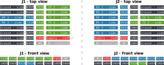

.. _sec-digital-isolator-6t2r:

digital-isolator-6t2r
=====================

The ``digital-isolator-6t2r`` is a board containing two digital isolators, providing a total of 6 TX channels and 2 RX channels. The board supports digital isolators with SOIC-16W package. A diagram of the board is shown in :numref:`fig-digital-isolator-6t2r-diagram`, where:

* :math:`\text{V}_\text{DDA}`/:math:`\text{GNDA}` and  :math:`\text{V}_\text{DDB}`/:math:`\text{GNDB}` are the supply to each side.
* :math:`\text{TX1}_\text{B}, \dots, \text{TX6}_\text{B}` are the TX pins on side B.
* :math:`\text{RX1}_\text{B}` and :math:`\text{RX2}_\text{B}` are the TX pins on side B.
* :math:`\text{TX1}_\text{A}` and :math:`\text{TX2}_\text{A}` are the TX pins on side A.
* :math:`\text{RX1}_\text{A}, \dots, \text{RX6}_\text{A}` are the TX pins on side A.

   
   Diagram of the board.

.. note::
   TX and RX pins are defined with respect to the board. Thus, TX pins on the board are outputs, and RX pins are inputs.

.. note::
   The board is denoted ``6t2r`` based on the number of TX and RX of side B. This is typically the side that would be connected to the target application, while side A is connected to the controller (thus providing the controller with 6 TX and 2 RX channels).

Board and pinout
----------------

A fully populated board is shown in :numref:`fig-digital-isolator-6t2r-board`. The six TX signals and two RX signals are on the left (connector J1). The board's pinout is shown in :numref:`fig-digital-isolator-6t2r-pinout`.

.. figure:: media/digital-isolator-6t2r/board.svg
   :name: fig-digital-isolator-6t2r-board
   :scale: 12%
   :align: center
   :alt: Populated board.
   
   Populated board.

   
   Pinout of the board.

Digital isolator compatibility
------------------------------

The board supports any isolator having the footprint shown in :numref:`fig-digital-isolator-6t2r-footprint`. Example of compatible isolators:

* Analog Devices' ADuM1401
* Texas Instruments' ISO6741
* Skyworks' Si8641

.. figure:: media/digital-isolator-6t2r/dig-iso-footprint.svg
   :name: fig-digital-isolator-6t2r-footprint
   :scale: 85%
   :align: center
   :alt: Footprint of isolator.
   
   Isolator's footprint.

.. note::
   The ENA and ENB pins are connected to their respective VDD pins on the board through a pull-up resistor. Should you instead need a low level on ENA/ENB to enable the chip, it is possible to simply do a solder bridge between EN and GND on the board.

.. note::
   The footprint of the isolator of this board is the same as in the :ref:`sec-digital-isolator-6t2r` board.
   
Isolator diagram
--------------------

The diagram of a single isolator is show in :numref:`fig-digital-isolator-6t2r-diagram-single`. TX lines contain a series resistor to help with ringing in case of driving capacitive lines. In most cases, a value of 10R-47R should be enough. The inputs contain a pull-down resistor to prevent floating signals at the input of the isolator. These might not be necessary depending on the part used. For example, ADuM1401 does not contain any pull down resistors (see `here <https://ez.analog.com/interface-isolation/f/q-a/86929/adum14x-does-adum14x-has-internal-pull-up-or-pull-down-resistor>`__ and `here <https://ez.analog.com/interface-isolation/f/q-a/84971/adum-unused-inputs>`__), while ISO6741 might (see `here <https://e2e.ti.com/support/isolation-group/isolation/f/isolation-forum/1216369/iso6740-input-pull-down-resistor-tolerance>`__).

   
   Diagram of single isolator.

Usage as 2 TX and 6 RX
-----------------------

If this board has 6 TX and 2 RX channels on side B, and I need 2 TX and 6 RX channels instead, can't I simply use the board through side A instead? Why is there a :ref:`sec-digital-isolator-2t6r` board for this purpose?

Using the board from side A to get 6 TX and 2 RX channels is perfectly fine. Note, however, that the connections will be mirrored. 

In order to keep the same connections, but reversed TX and RX, board was :ref:`sec-digital-isolator-2t6r` designed. The main motivation for this is designing a single connector board for a controller that has a standard type of connector, and different applications would use different boards depending on the number of required TX and RX channels.

.. note::
   - TODO: mention relation to pynq adapter board.

Why this number of channels?
----------------------------

This board was originally designed to be a counterpart of the :ref:`sec-digital-isolator-2t6r` board. Since that board has 2 TX and 6 RX channels, this one was designed to have 6 TX and 2 RX channels.

Application example
-------------------

:numref:`fig-digital-isolator-6t2r-example` shows one example where the ``digital-isolator-6t2r`` board was used. In the example, the board was used to provide isolation between a controller and an experimental dc-dc converter. More specifically, the board was used to isolate PWM signals and relay commands, sent by the controller to the converter. The board used Si8641 chips with PWM signals of 200 kHz.

.. figure:: media/general/pynq-plus-adapters-buck.svg
   :name: fig-digital-isolator-6t2r-example
   :scale: 13%
   :align: center
   :alt: Pynq and adapter boards.
   
   6T2R isolator board put to use.

Fabrication files
-----------------

To get the gerber files used to fabricate the isolator board, checkout commit ``0a362f3999cce0dbfa685b3a4d768572d0c33a98``, and find the files under ``digital-isolator-6t2r/gerber``.